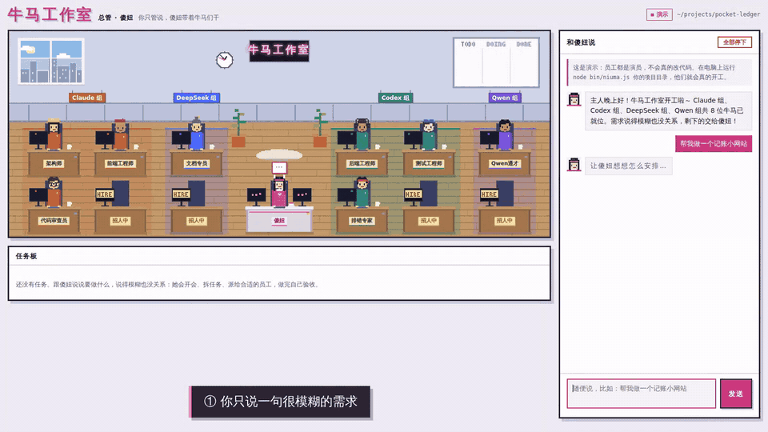

# 牛马工作室

一家 AI 牛马组成的像素软件工作室。你只跟总管**傻妞**说话：她听懂你要什么（说得模糊也没关系），召集员工开项目会、按难度和技能派活、盯进度、安排审查和验收，没做完就自己组织下一轮，直到真正做完，再向你汇报。整个过程不需要你插手。

工作室按**项目组**编排，每个项目组就是一种 AI 模型：Claude Code、Codex、DeepSeek、中转站 API……组里坐着各有技能的**员工**，每个员工就是一个 skill 文件。所有人在一间像素办公室里上班：谁在读哪个文件、跑什么命令，头顶气泡里都看得到；开会时大家走到会议桌边发言；派活时傻妞会起身把任务单送到工位上。



完整演示视频（1 分 50 秒，带字幕）：[docs/niuma-demo.mp4](docs/niuma-demo.mp4)

## 一个需求是怎么被做完的

1. **听**：你说「帮我做个记账小网站」。傻妞自己补全细节（技术栈、功能范围、数据怎么存），把假设告诉你，不反问。
2. **开会**：新项目、大功能、要选框架或设计数据库时，傻妞拉 2～4 位相关员工开项目会。每人从自己的岗位出发发言，架构师拍板，写出会议纪要（技术栈、目录结构、数据库表设计、接口约定）。纪要存进项目的 `docs/meetings/`，之后每个任务都必须照着做。小改动不开会。
3. **派活**：按纪要拆成任务，给每个任务定难度（难/中/易），挑技能对口的员工。难题交给强模型，杂活交给便宜的模型，同一个项目组也会按难度自动切换型号（比如 Claude 组：难用 Opus、中用 Sonnet、易用 Haiku）。任务板上写着为什么派给他。
4. **干活**：互不依赖的任务同时开工，前一个人的汇报会自动交给下一个人。
5. **审查**：有代码改动时，由没写这段代码的员工审查；不通过就退回返工，再复审。
6. **验收**：全部做完后，验收员对照你的原始需求实际检查，能跑的都跑一遍。没做完就列出问题，傻妞自动安排下一轮，最多 3 轮。
7. **兜底**：有人失败（额度用完、报错、超时），傻妞把任务换给别的员工接手。
8. **存档**：每一轮开工前、完工后都自动 `git commit`，说一句「/撤销」就能撤回整轮改动。

## 亮点

- **说句模糊的话就行**：傻妞自己补全细节、不反问，干完自己验收，没做完自动再来一轮。
- **开项目会**：新项目先讨论框架、目录和数据库，纪要存进项目，所有人照着做。
- **按难度派活**：难题给强模型，杂活给便宜模型，同一个组也会按难度切换型号。
- **什么模型都能当员工**：Claude Code、Codex、DeepSeek、通义、Kimi、智谱、中转站、本地模型……见 [接入 API 指南](docs/api-guide.md)。
- **skill 就是员工**：写一个 Markdown 岗位说明就多一名员工，或者让傻妞 `/招人`。
- **放心全自动**：每轮自动 git 存档，一句 `/撤销` 撤回；危险命令一律拦截。
- **零依赖**：只要 Node 18+，不用 `npm install`。

## 准备

- Node.js 18 或更高版本
- 至少有一个项目组能用（多多益善）：
  - Claude Code：`npm i -g @anthropic-ai/claude-code`，运行一次 `claude` 登录
  - Codex：`npm i -g @openai/codex`，运行一次 `codex` 登录
  - 或者任意 OpenAI 兼容的 API（DeepSeek、中转站、通义、Kimi、GLM、本地模型……），见下文

不需要 `npm install`，傻妞没有任何第三方依赖。

## 快速开始

```bash
git clone https://github.com/Leeeger1/niuma-studio.git
cd niuma-studio

# 先彩排：用替身员工演一遍完整流程，不花钱、不改文件
node bin/niuma.js --fake

# 真干活：把你的项目目录传进去（空文件夹也行，傻妞会从零开始建项目）
node bin/niuma.js ~/code/my-project
# Windows：node bin\niuma.js D:\code\my-project
```

浏览器会自动打开 `http://localhost:7777`。想在任何目录直接敲 `niuma`，在仓库目录里运行一次 `npm link`。

## 公司架构

### 项目组 = 模型

| type | 是什么 | 怎么接 |
|---|---|---|
| `claude-cli` | Claude Code 命令行，自带读写文件、跑命令等全套工具 | 装好 `claude` 即可。走中转站就在 `env` 里设 `ANTHROPIC_BASE_URL` 和 `ANTHROPIC_AUTH_TOKEN` |
| `codex-cli` | Codex 命令行 | 装好 `codex` 即可 |
| `openai-api` | 任意 OpenAI 兼容接口。傻妞内置了一个编程员工，会列目录、读写文件、精确替换、搜索、跑命令 | 填 `baseUrl`、`apiKey`（或 `apiKeyEnv`）和模型名 |

默认有 Claude 组和 Codex 组。在配置里加项目组就是多一片工位。**详细的接入方法（DeepSeek、中转站、通义、Kimi、智谱、硅基流动、OpenRouter、本地模型，以及怎么让 Claude Code 走中转）见 [接入 API 指南](docs/api-guide.md)。**简单的例子：

```json
{
  "groups": [
    {
      "id": "deepseek",
      "name": "DeepSeek 组",
      "type": "openai-api",
      "baseUrl": "https://api.deepseek.com",
      "apiKeyEnv": "DEEPSEEK_API_KEY",
      "models": { "hard": "deepseek-v4-pro", "medium": "deepseek-v4-flash", "easy": "deepseek-v4-flash" }
    },
    {
      "id": "relay",
      "name": "中转站组",
      "type": "openai-api",
      "baseUrl": "https://你的中转站地址/v1",
      "apiKey": "${RELAY_API_KEY}",
      "model": "qwen3-coder"
    },
    {
      "id": "claude-relay",
      "name": "Claude 中转组",
      "type": "claude-cli",
      "env": { "ANTHROPIC_BASE_URL": "https://你的中转站地址", "ANTHROPIC_AUTH_TOKEN": "${RELAY_API_KEY}" }
    }
  ]
}
```

- `models` 按难度指定型号；只写 `model` 就是所有难度都用它。
- API Key 建议放环境变量：`apiKeyEnv` 写变量名，或者在任何字段里用 `${变量名}`。不要把 Key 直接写进项目目录里的配置文件（傻妞的自动存档会跳过 `niuma.config.json` 和 `.env`，但放在 `~/.niuma/config.json` 更稳妥）。
- 其他可选字段：`color`（工位颜色）、`maxParallel`（这个组同时最多干几件活）、`strengths` / `tier` / `cost`（覆盖傻妞对这个模型的判断）、`price`（每百万 token 的输入/输出价格，用来在任务板上显示花费）、`headers`、`maxTokens`、`temperature`、`extraArgs`（传给命令行的额外参数）、`enabled: false`（整组放假）。

傻妞认识常见模型的档次和价位（Opus/Sonnet/Haiku、GPT、Codex、DeepSeek、Qwen、Kimi、GLM、Gemini……），没认出来的按 `tier`、`cost` 字段或者默认值算。

### 员工 = skill

每个员工是一个 Markdown 文件，格式和 Claude Code 的 SKILL.md 一样：

```markdown
---
name: 数据库专家
description: 设计表结构、写查询和迁移、排查慢查询，适合数据库相关的任务
group: codex
look: glasses
---
- 改表结构前先确认现有数据怎么迁移
- 查询要考虑索引
- 做完用真实数据跑一遍
```

- `description` 是傻妞派活时看的那一句，写清楚擅长什么。
- `group` 写这个员工坐在哪个项目组。
- `look` 是像素小人的配饰：`none` `glasses` `headphones` `cap` `beret` `helmet` `bandana` `bun`。
- 正文是岗位守则，这个员工每次干活都会先读它。

**把文件放进 `~/.niuma/skills/`（所有项目通用）或 `项目目录/.niuma/skills/`（只在这个项目），它就是一名新员工。**也支持 `名字/SKILL.md` 的文件夹写法。或者直接对傻妞说「/招人 数据库专家」，她会自己写好岗位说明，把人招进合适的项目组。

内置岗位在 `skills/` 目录：全栈工程师、架构师、前端工程师、后端工程师、测试工程师、代码审查员、排错专家、文档专员。默认编制是 Claude 组坐架构师、前端、审查员，Codex 组坐后端、测试、排错专家。在配置里用 `employees` 调整：

```json
{
  "employees": [
    { "id": "writer", "skill": "writer", "group": "deepseek" },
    { "id": "frontend", "group": "deepseek" },
    { "id": "debugger", "enabled": false }
  ]
}
```

没有安排任何员工的项目组会自动配一名全栈工程师。

## 在网页里怎么用

- **直接说**：在右边输入框说需求，Enter 发送，Shift+Enter 换行（中文输入法选词时按 Enter 不会误发）。忙的时候发的新消息会排队。
- **点名**：`@frontend 把按钮改成圆角`，或者 `@claude …`（交给 Claude 组的人），跳过规划直接派。
- `/招人 描述`：招一名新员工。
- `/团队`：看看有哪些项目组和员工，以及大家的战绩。
- `/撤销`：撤回上一轮的全部改动（生成一个 revert 提交，历史不会丢）。任务板上也有「撤销上一轮」按钮。
- `/stop`：叫停所有正在干的活，正在跑的进程会被结束。
- `/reset`：让傻妞忘掉之前的对话。
- **任务板**：每个任务都能展开，看到难度、用的模型、为什么派给他、换过谁、傻妞的交代、实时过程和最终汇报。项目会议的纪要也在这里。

办公室会跟着系统的深色/浅色模式切换成夜晚或白天；墙上的钟是真实时间，白板上的便利贴就是当前的任务。

## 全自动与安全

默认是**全自动**（`autonomy: "full"`），员工干活不用问你：

| | 全自动（默认） | 安全模式（`--safe`） |
|---|---|---|
| Claude 组 | 可以改文件、跑任意命令 | 只能跑白名单命令（git 只读、npm、node、python、pytest、go、cargo、make 等） |
| Codex 组 | `workspace-write` 沙箱，只能写项目目录，允许联网装依赖 | 沙箱内不联网 |
| API 组 | 只能读写项目目录里的文件，命令不限 | 命令走白名单 |

不管哪种模式，这些命令都不会自动执行：`sudo`、`git push`、`git reset --hard`、`git clean`、`rm -rf /`、`rm -rf ~`。审查和验收是只读的。

兜底靠 Git：每一轮开工前把你没提交的改动先存一档，完工后再存一档；不是 Git 仓库的目录会自动 `git init`（并写一个默认 `.gitignore`）。自动存档会跳过 `node_modules`、`.venv`、`__pycache__`、`.env*` 和 `niuma.config.json`。不想自动提交就把 `git.autoCommit` 设成 `false`。

网页默认只监听本机（`127.0.0.1`），拒绝其他网站发来的请求。想用手机看直播：`node bin/niuma.js --host 0.0.0.0`，终端会打印一个带访问口令的局域网地址。

## 配置

配置按这个顺序叠加，后面的覆盖前面的：内置默认值 → `~/.niuma/config.json` → `项目目录/niuma.config.json` → `--config 指定的文件` → 命令行参数。`groups` 和 `employees` 按 `id` 合并：同一个 id 是修改，新 id 是新增。可以从 [`niuma.config.example.json`](niuma.config.example.json) 复制一份改。

| 字段 | 默认 | 说明 |
|---|---|---|
| `brain` | `claude` | 哪个项目组给傻妞当大脑（规划、开会拍板前的判断、汇报）。不在岗时自动换最强的组 |
| `brainModel` | 空 | 大脑用的型号，默认用该组的「中」档 |
| `autonomy` | `full` | `full` 全自动，`safe` 安全模式 |
| `parallel` | `true` | 允许同时干活。`--serial` 临时关掉 |
| `maxIterations` | `3` | 验收不通过时，最多补几轮 |
| `maxFixRounds` | `1` | 审查要求返工时，最多返工几轮 |
| `maxRetries` | `1` | 任务失败后换几次人 |
| `meeting.enabled` / `meeting.save` / `meeting.maxAttendees` | `true` / `true` / `4` | 项目会议开关、是否把纪要存进 `docs/meetings/`、最多几人参会 |
| `git.autoInit` / `git.autoCommit` | `true` / `true` | 自动建仓库、每轮自动存档 |
| `dispatchDelayMs` | `1500` | 派活前的停顿（傻妞走过去送任务单的时间） |
| `taskTimeoutMin` | `30` | 单个任务超时（分钟） |
| `historyRounds` | `6` | 傻妞记住最近几轮对话 |
| `logDir` | `~/.niuma/logs` | 每次调用的完整提示词和原始输出 |
| `statsFile` | `~/.niuma/stats.json` | 员工战绩，派活时会参考 |

## 常见问题

**项目组显示「未到岗」**：命令行组要能在终端里直接运行 `claude --version` / `codex --version`；装在别处就在组配置里写 `"command": "完整路径"`。API 组看提示：没配 Key、Key 被拒绝、或者连不上地址。

**Opus 用不了怎么办？** Claude 组调用时会带上 `--fallback-model sonnet`，Opus 不可用或过载时自动退回 Sonnet。也可以直接改 `models`。

**会花多少钱？** 每个需求至少有一次规划、一次验收和一次汇报；开会时每位参会员工发言一次，主持人拍板一次；每个任务一次员工调用。Claude 任务在任务板上显示花费，API 任务显示 token 数（配了 `price` 就显示花费）。杂活交给便宜的项目组、把 `brainModel` 设成便宜型号都能省钱。

**两个人同时改会冲突吗？** 傻妞只让改不同文件的任务并行，并在交代里写明各自负责哪些文件。不放心就用 `--serial`。

**哪里看细节？** 任务板里展开任务；更完整的记录在 `~/.niuma/logs`。

## 许可证

[MIT](LICENSE)。欢迎提 Issue 和 PR：新岗位 skill、新平台的接入经验、像素小人的新造型都很欢迎。

## 项目结构

```
bin/niuma.js         命令行入口
src/coordinator.js    调度核心：规划、开会、派活、审查返工、验收迭代、换人、存档、招人
src/team.js           项目组和员工的组装
src/models.js         傻妞对各个模型的了解（能力、价位、擅长什么）
src/skills.js         skill 文件的读取和生成
src/workers/cli.js    Claude Code / Codex 命令行员工
src/workers/openai.js 内置的 API 编程员工（OpenAI 兼容接口 + 文件和命令工具）
src/git.js            自动存档和撤销
src/prompts.js        傻妞的人设和各种提示词
src/server.js         本地网页服务（Server-Sent Events 推送实时状态）
skills/               内置岗位
public/               像素办公室网页（office.js 是画面，demo.js 是没有服务器时的演示）
fake/                 彩排用的替身员工和假 API
test/                 测试：npm test
```
